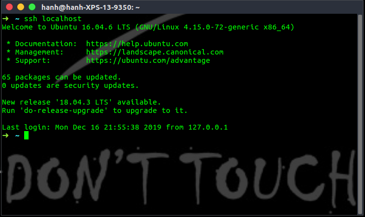

# [MI3.02: Cloud and BigData With Java]


###  Master Hadoop, Spark, streaming, and scaling in BigData


## About the reporestory

This is a hand-on instructions from setup to mini-labworks to help us get familar with concepts of Hadoop and Spark, based on lectures and labworks of [Prof. Daniel Hagimont](http://sd-127206.dedibox.fr/hagimont/).


## Table of Contents

### 00. Installation prerequisite for labworks
FYI I used with JDK-8 and Hadoop 2.7.1, preferable Ubuntu 16.04 with enough space to install Java, Eclipse, Hadoop, etc...

1. Open the Linux terminal and install __openssh-server__.
```console
$ sudo su
$ apt-get update
$ apt-get install openssh-server
```
2. Create a user
```
$ useradd hanh 
$ passwd hanh 
   New passwd: 
   Retype new passwd 
```
3. SSH Setup and Key Generation

```
$ ssh-keygen -t rsa 
$ cat ~/.ssh/id_rsa.pub >> ~/.ssh/authorized_keys 
$ chmod 0600 ~/.ssh/authorized_keys 
```
You can test on your localhost by:
```
ssh localhost
```


4. Install JAVA, eclipse
   - You should have Java installed and the JAVA_HOME variable defined
   - You should have your ssh keys configured to allow ssh to localhost
5. HADOOP
   - Untar the hadoop-2.7.1.tar.gz archive
      - Define environment variables 
         ```
         export HADOOP_HOME=<path>/hadoop-2.7.1 
         export PATH=$HADOOP_HOME/bin:$HADOOP_HOME/sbin:$PATH
         ```
   - You can use eclipse to develop applications
      - You have to add the following jars in your eclipse projet
         ```
         - <hadoop-home>/share/hadoop/common/hadoop-common-2.7.1.jar
         - <hadoop-home>/share/hadoop/mapreduce/hadoop-mapreduce-client-common-2.7.1.jar
         - <hadoop-home>/share/hadoop/mapreduce/hadoop-mapreduce-client-core-2.7.1.jar
         ```
   - To execute Hadoop in local mode, you have to configure the following files:
      - <hadoop-home>/etc/hadoop/core-site.xml:

         ```
         <configuration>
               <property>
                     <name>fs.defaultFS</name>
                     <value>hdfs://localhost:9000</value>
               </property>
         </configuration>
         ```

      - <hadoop-home>/etc/hadoop/hdfs-site.xml:

         ```
         <configuration>
               <property>
                     <name>dfs.replication</name>
                     <value>1</value>
               </property>
         </configuration>
         ```

      - <hadoop-home>/etc/hadoop/hadoop-env.sh:
            hardcode the JAVA_HOME variable

### 01. Hadoop
You are given a file containing meterological data about cities all over the planet. You have to implement two map-reduce jobs that:
- compute the maximum temperature for each year
- compute the number of months which had a temperature higher than a given value (a parameter).
- the format of a line in the file is : day : month : year : temperature : city

The solution is available in [01.Hadoop](https://github.com/honghanhh/bigdata/01.hadoop/)
### 02. Spark
Implement the same application as in the previous labwork (Hadoop), but with Spark.
### 03. Streamming
### 04. Scaling
### 05. Project
(updating)

